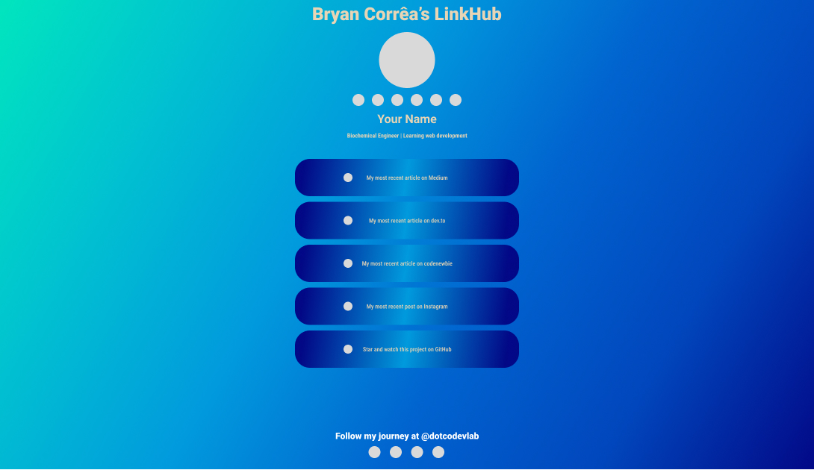

**Clique [aqui](./src/txt/readme_ptbr.md) para ler este arquivo em PT-BR.**  

>**See the previous version of this project [here](https://github.com/bryrrea/my_linkhub)** 

# **LinkHub Project**  

## **License**  
This project and all its contents are licensed under [CC BY-SA 4.0](https://creativecommons.org/licenses/by-sa/4.0/) and [Beerware](https://people.freebsd.org/~phk/), unless otherwise stated.  

## **About this project**  
Hi! My name is Bryan. Nice to meet you! I'm from Brazil and just graduated as a Biochemical Engineer. I always liked tech and programming, but I couldn't study about it before. Now I've been learning front-end web development for 11 days. It has been a good journey so far.  
My first "solo" project is **LinkHub**. This repo is the second version of this project. The original version can be seen [here](https://github.com/bryrrea/linkhub_v2).  
Much of text below was copied from the original version of the project. I was thinking to deleting the old version, but I think it is better to keep it. However, I decided not to copy the "schedule" file, since this new version took a very short time to do. If you want to see my schedule template, take a look [here](https://github.com/bryrrea/linkhub_v2/blob/master/src/txt/schedule.md).  

## **Problem Statement**  
I was creating social media profiles to share my progress and learning process while studying web development. I also want to give tips on free and quality material, what to study and how to study. I need the social media to apply the Feynman Study Method, which will help my learning process, as I had done during my undergrad.  
When I created the Instagram profile to share my learning, I was thinking of sharing my social media links. And here I had a problem: almost all social media allow you to share only one link. We have some aggregators - like Linktree - that we can place our links there and solve the problem, right? **RIGHT**? Well, kinda. But then you will face another problem: **the social media algorithm**.  
I know enough about SEO to know that your profile and subject matter can lose relevance if you use an aggregator app on your profile. So I thought I would cut out the middleman and create a page to centralize all my links into just one link that belongs to me.  

## **Objective**  
The goal of this project is to develop a single webpage with all my links, trying to replace the use of link aggregators. I'll try to apply SEO in the page using **metatags**. With this I hope to show that you have an alternative to share your links without losing relevance in search engines and social media algorithms (specially if you own a business with many people clicking and sharing your socials and services). 

## **The project**  
LinkHub is a front-end project which I will create a single webpage to share all my links there. I will create the design and the webpage itself.  
The interaction between user and interface will be through clicks, which means that if a person clicks on one of the buttons or one of the social media icons, they will be forwarded to the web address linked to that button or icon.  

### **Tools and Technologies used**  
#### **Design**  

|||
|:--------------:|:--------------:|  

##### **Color palette**  
  

##### **Fonts**  
You can download the Roboto font [here](https://fonts.google.com/download?family=Roboto) and Roboto Condensed [here](https://fonts.google.com/download?family=Roboto%20Condensed).  

#### **Coding**  

||||
|:--------------:|:---------------:|:--------------:|
|||  

##### **Screenshot of the prototype**  

  

>I'm not a designer and am just a beginner in web design and development. I will appreciate if you have some tips or constructive criticism about this project. If you do, leave a message in the link below. Thanks! See'ya!  

  
  
 Click on the image above to sign my guestbook and leave your feedback!!

